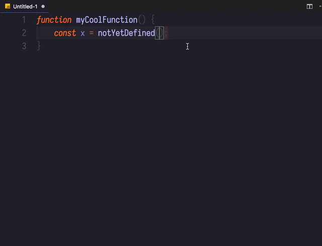

# code-marks 

code-marks provides features to create and jump to marks throughout your code.

## Features

Create, clear, list, and jump to marks throughout your code using either commands or key strokes.

Provides the Following Commands:  
- Create Mark
    - After running the create mark command Code Marks will wait for another key to be pressed. If it is a lowercase letter, code marks will create a local mark for the current file. If it is an uppercase letter, code marks will create a global mark. Local marks can only be accessed in the file they were created in. Creating a mark with the same binding and location as a previous mark will clear that mark instead.
- Jump To Mark
    - See Create Mark description for usage. This command just jumps to a mark instead of creating one.
- List Marks
- Delete Mark From List
- Clear all Marks

<!--
## Requirements

If you have any requirements or dependencies, add a section describing those and how to install and configure them.

## Extension Settings

Include if your extension adds any VS Code settings through the `contributes.configuration` extension point.

For example:

This extension contributes the following settings:

* `myExtension.enable`: enable/disable this extension
* `myExtension.thing`: set to `blah` to do something

## Known Issues

Calling out known issues can help limit users opening duplicate issues against your extension.

## Release Notes

Users appreciate release notes as you update your extension.

### 1.0.0

Initial release of ...

### 1.0.1

Fixed issue #.

### 1.1.0

Added features X, Y, and Z.

-----------------------------------------------------------------------------------------------------------

## Working with Markdown

**Note:** You can author your README using Visual Studio Code.  Here are some useful editor keyboard shortcuts:

* Split the editor (`Cmd+\` on macOS or `Ctrl+\` on Windows and Linux)
* Toggle preview (`Shift+CMD+V` on macOS or `Shift+Ctrl+V` on Windows and Linux)
* Press `Ctrl+Space` (Windows, Linux) or `Cmd+Space` (macOS) to see a list of Markdown snippets

### For more information

* [Visual Studio Code's Markdown Support](http://code.visualstudio.com/docs/languages/markdown)
* [Markdown Syntax Reference](https://help.github.com/articles/markdown-basics/)

**Enjoy!** -->
